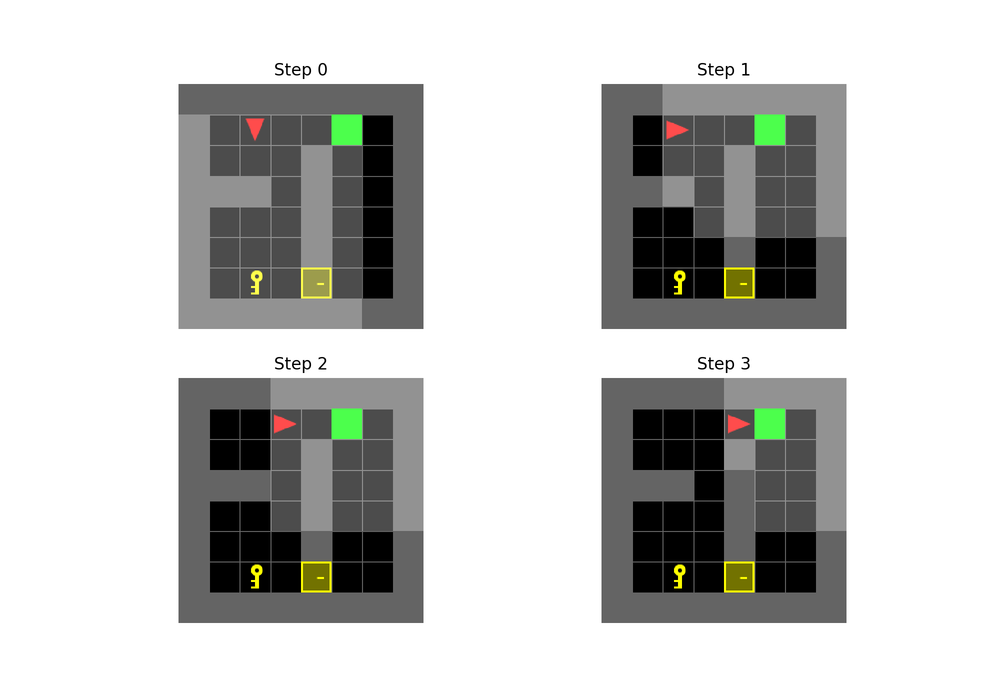
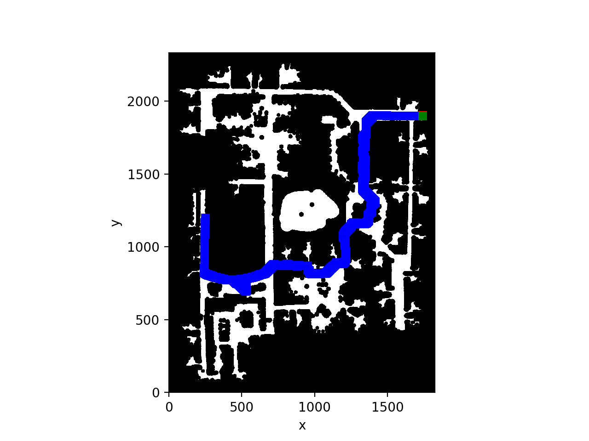
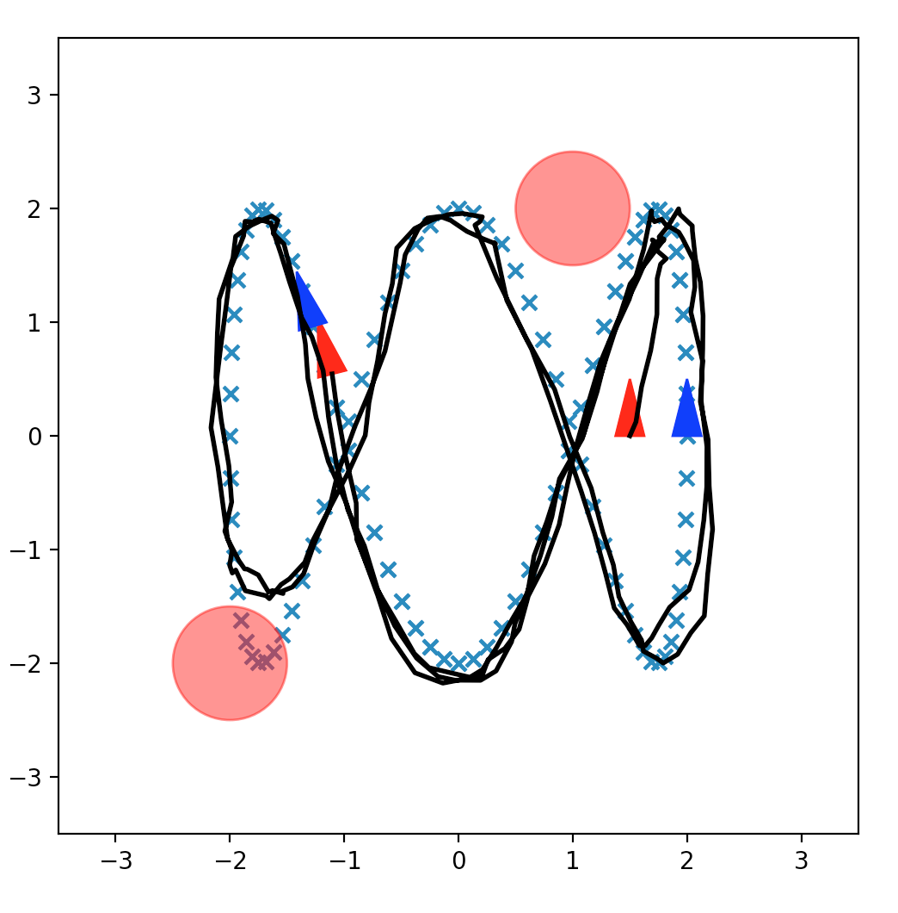

# Robotics-Planning-Control
UCSD SP22 ECE276B Projects, basically about robotics planning and control algorithms. Including dynamic programming, all kinds of planning algorithms and certainty equivalence control.

### Door & Key Dynamic Programming

### Catch a Target (A* / Jump Point Search / RTAA*)

### Certainty Equivalence Control

